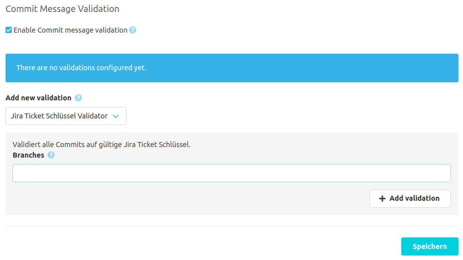

Wenn das [SCM-Commit-Message-Checker-Plugin](https://scm-manager.org/plugins/scm-commit-message-checker-plugin/) installiert wurde, 
liefert das Jira-Plugin einen eigenen Validator für Commitnachrichten. Dieser Validator kann bei der Commitnachricht-Validierung konfiguriert werden.

# Validatorkonfiguration
Der Jira-Ticketschlüsselvalidator überprüft sämtliche neuen Commits auf gültige Ticketschlüssel. 
Die Ticketschlüssel müssen mit der Konfiguration im Jira-Plugin übereinstimmen.
Dieser Validator kann auch nur auf einen definierten Satz von Branches angewandt werden. Wird kein Branch angegeben, werden alle Branches validiert.
Jeder neue Commit, welcher nicht einen gültigen Ticketschlüssel enthält, wird vom SCM-Manager abgelehnt.

Beispiel: Wenn Sie in der Jira-Pluginkonfiguration den Projektfilter auf "SCM" setzen, werden nur
Namen mit entsprechendem Signaturanfang (z. B. "SCM-4584") als gültig anerkannt.

