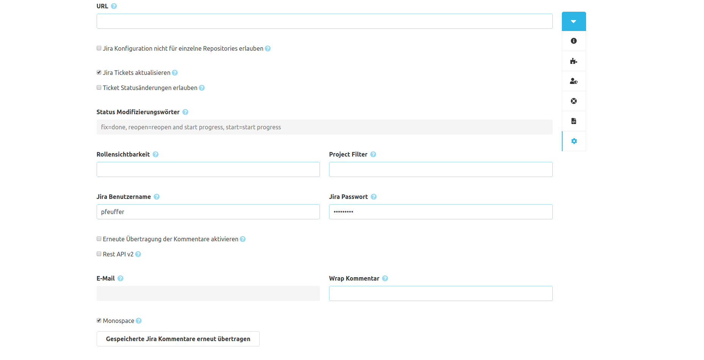

Wie im SCM-Manager 3 üblich, gibt es eine globale und eine repository-spezifische Konfiguration für das Jira-Plugin. 
Die globale Konfiguration gilt für alle Repositories, die keine spezifische Konfiguration hinterlegt haben. 
Inhaltlich unterscheiden sich die Konfigurationen lediglich darin, dass in der globalen Konfiguration die repository-spezifische Konfiguration deaktiviert werden kann.

### Konfigurationsformular
Für die Kommunikation zwischen dem SCM-Manager und Jira muss zunächst zwingend die Jira-URL inklusive Kontextpfad eingetragen werden.
Wird das Feld 'filter' leer gelassen, findet SCM-Manager Ticket-IDs von allen Jira-Projekten.
Über das Feld 'filter' lässt sich das einschränken. Hier kann eine kommaseparierte Liste von Jira-Projektkürzeln eingetragen werden.
Anschließend lässt sich konfigurieren, in welcher Form Jira-Tickets verändert / ergänzt werden sollen.

#### Kommentare erzeugen
Um Kommentare in Jira zu erzeugen, werden Zugangsdaten benötigt, welche einem technischen Jira-Benutzer gehören sollten.
Dieser Benutzer benötigt zudem ausreichende Berechtigungen, um Kommentare an existierenden Tickets zu erstellen.

Die Kommentare werden am Jira-Ticket erzeugt, sobald innerhalb einer Commit-Nachricht, einem Pull Request oder einem Pull Request-Kommentar die Ticket-ID erwähnt wurde.

Beispiel für eine Commit-Nachricht: *"SCM-42 Add awesome new feature"*

Damit wird ein Kommentar mit dieser Commit-Nachricht am Jira-Ticket *SCM-42* erzeugt.

Dieses Plugin verschickt Kommentare mit einer 'internal'-Flag. 
Das Feature wird von bestimmten Projekten in Jira Service Management unterstützt und beschränkt 
die Sichtbarkeit der Kommentare im Portal. Falls das Feature nicht unterstützt wird, 
werden die Kommentare für alle auf das Ticket zugriffsberechtigten Personen angezeigt.

#### Ticket-Statusaktualisierung
Um den Status eines Tickets über die Nachricht eines Commits oder einem Pull Request zu ändern, 
kann eine Ticket-ID mit einem Jira-Statusübergang innerhalb eines Satzes verwendet werden.

Beispiel Commit Nachricht: "Bug SCM-42 is done"

Das Beispiel setzt den Status des Tickets SCM-42 auf "Done".
Das setzt natürlich voraus, dass es den Statusübergang "Done" an dem Ticket SCM-42 gibt.

Über die "Statusmodifizierungswörter" lassen sich Wörter definieren, die anstelle des Jira-Statusübergangs verwendet werden können.
Diese Schlüsselwörter kann man in Form einer kommaseparierten Liste angegeben.
Zum Beispiel könnte man für den Status "Done" folgende Schlüsselwörter angeben: "closes, closing".
Damit würde der Text "Closes Bug SCM-42" ebenfalls das Ticket SCM-42 auf den Status "Done" setzen.

Wenn Statusübergänge nur aufgrund von Pull Requests und nicht aufgrund von Commits durchgeführt werden soll, kann
zusätzlich die Option "Deaktiviere Statusänderungen durch Commits" aktiviert werden.

> **Wichtig:** Der konfigurierte Jira-Benutzer benötigt Berechtigungen, um den Status von Tickets zu ändern.

