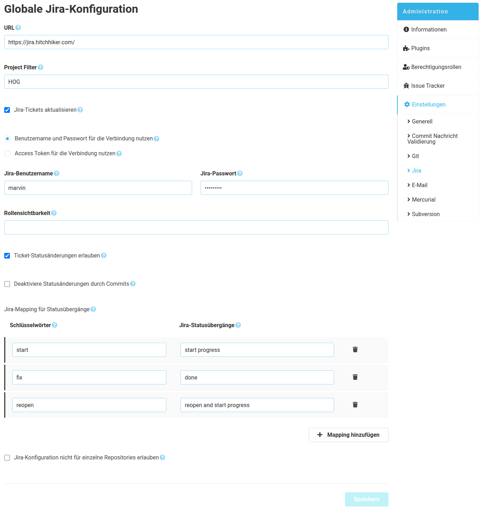

Wie im SCM-Manager 2 üblich, gibt es eine globale und eine repository-spezifische Konfiguration für das Jira-Plugin. Die globale Konfiguration gilt für alle Repositories, die keine spezifische Konfiguration hinterlegt haben. Inhaltlich unterscheiden sich die Konfigurationen lediglich darin, dass in der globalen Konfiguration die repository-spezifische Konfiguration deaktiviert werden kann. 

### Konfigurationsformular
Für die Kommunikation zwischen dem SCM-Manager und Jira muss zunächst zwingend die Jira Instanz-URL inklusive Kontextpfad eingetragen werden. Zusätzlich werden auch noch Zugangsdaten benötigt, welche einem technischen Jira Benutzer gehören sollten.
Anschließend lässt sich bereits konfigurieren in welcher Form Jira Tickets verändert / ergänzt werden sollen. Es können dabei über Filter bestimmte Projekte oder die Rollensichtbarkeit eingeschränkt werden.

#### Ticket Status Aktualisierung
Über die "Status Modifizierungswörter" lassen sich Wörter definieren, die bei Ihrer Erwähnung in der Commit Nachricht zu einer Status Aktualisierung des Jira Tickets führen.

#### Kommentare erzeugen
Die Kommentare werden am Jira Ticket erzeugt, sobald innerhalb einer Commit Nachricht die Ticket-ID erwähnt wurde.

Beispiel Commit Nachricht: "#492 fix user permissions bug."

Damit wird ein Kommentar mit dieser Commit Nachricht am Jira Ticket 492 erzeugt und dieses Ticket auf den Status "done" umgesetzt.

#### Nicht übertragene Kommentare
Bei einem Verbindungsproblem zwischen dem SCM-Manager und Jira werden die Kommentare in einem internen Speicher aufbewahrt, bis sie erfolgreich übertragen werden konnten. 
Es gibt dabei die Möglichkeit das automatische erneute Übertragen zu aktivieren oder dies über eine Schaltfläche manuell zu tun.
Außerdem gibt es die Möglichkeit eine E-Mail-Adresse zu hinterlegen, um benachrichtigt zu werden, sobald Kommentare nicht übermittelt werden konnten.

