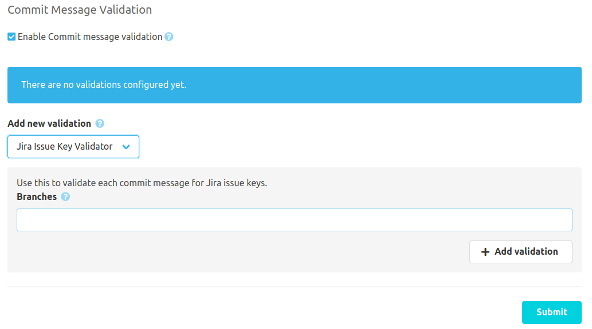

If the [SCM-Commit-Message-Checker-Plugin](https://scm-manager.org/plugins/scm-commit-message-checker-plugin/) is installed, 
the Jira plugin will provide it's own commit message issue key validator. This can be configured right on the commit message validation config.

# Validator config
The Jira Issue Key Validator checks each commit for valid issue keys. The issue keys must match the Jira plugin config.
You may enable this validator only for a set of branches like "master,develop,feature/*". Leave branches blank to validate every branch.
All new commits which does not contain a valid issue key will be rejected by the SCM-Manager. 

Example: If you set the project filters in your Jira plugin configuration to "SCM" only issue keys beginning with this project id will be valid. 

