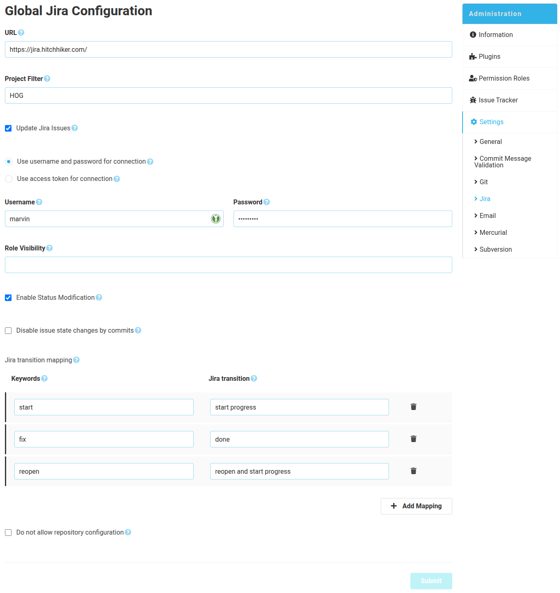

The Jira plugin can be configured globally for all repositories or specific for a single repository. If both are configured the specific config is used. The repository specific configuration can be disabled inside the global configuration.

# Configuration form
To connect the SCM-Manager to a Jira instance the Jira instance url including the context path is required. Also you need credentials which should belong to a technical Jira user.
Afterwards you may already configure what kind of issue updates the SCM-Manager should send to Jira. Using filters you can restrict the updates to specific projects or which project roles may see the comments. 

## Update issue status
SCM-Manager searches for issue keys and status modification words in commit messages. If both are found in a message SCM-Manager changes the status of the issue.

## Create comments
Comments will be created on the Jira issues, if a commit message contains the issue id.

Example commit message: "#492 fix user permissions bug."
With this example a comment with this commit message will be created for issue 492 and the issue will be updated to status "done".

## Resubmit comments
If the SCM-Manager cannot reach the Jira server with this option enabled all comments are stored in the SCM-Manager until they can be submitted successfully. 
Configure an e-mail-address to get notified as a submission fails. You can resubmit the stored comments manually or automatically.

